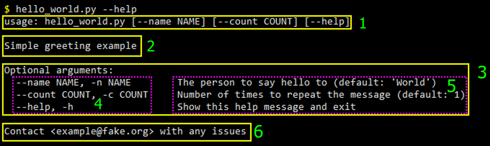
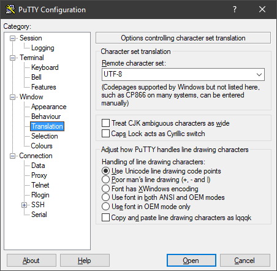

Documentation
*************

Help Text
=========

The ``--help`` / ``-h`` option is automatically added to Commands by default.  When specified, it takes precedence over
any other parameters.  The usage / help text that it prints is automatically generated based on the Command in use,
the file it is in, the Parameters in that Command, and any subcommands that are present.

The content of the help text can be configured when :ref:`initializing the Command <commands:Defining Commands>`.
It is also possible to :ref:`disable <configuration:Usage & Help Text Options>` the ``--help`` parameter by specifying
``add_help=False``, if desired.  If ``add_help`` is disabled, it is possible to define a different
:ref:`parameters:ActionFlag` to replace it, using a combination of
:paramref:`always_available=True<.ActionFlag.always_available>`, ``before_main=True``, and ``order=-1`` (or another
number that is lower than any other ActionFlag in the Command).

Help Text Breakdown
-------------------

To clarify what parts of help text are affected by different configuration options, the following screenshot has boxes
around each major section, which will be defined below:

#. **Usage line**: Example script invocation with basic usage info
#. **Command description**: Description provided as the ``description='...'`` class kwarg when defining a Command, or
   as the class docstring within the Command.
#. **Parameter list**: List of available parameters, with their usage info and descriptions
#. **Usage column**: Column within the parameter list that contains only usage info
#. **Parameter descriptions**: Column within the parameter list that contains the help text that was defined for each
   Parameter via ``help='...'``
#. **Epilog**: Footer for help text, with optional automatically detected content based on project metadata

Parameter List Formatting
-------------------------

The width of the usage column can be adjusted via the :ref:`configuration:Usage & Help Text Options:usage_column_width`
setting.

By default, the ``usage_column_width`` is not strictly enforced.  This means that if a given parameter has multiple
usage parts (e.g, an ``Option`` with both long and short option strings) and the combined parts would exceed that width,
they will be combined and use only one line.  The parameter's description (``help='...'`` value) will begin on the next
line.

The following example Command will be used to demonstrate::

    class Example(Command):
        very_long_name = Option('-v', metavar='FOO', help='Example description')

The example Command's help text::

    usage: example.py [--very-long-name FOO] [--help]

    Optional arguments:
      --very-long-name FOO, -v FOO
                                  Example description
      --help, -h                  Show this help message and exit

The :ref:`configuration:Usage & Help Text Options:strict_usage_column_width` setting can be used to enforce the usage
column width so that the usage parts will be split, and the description can begin on the same line as the first usage
part.

The same example Command as above, updated to use that setting::

    class Example(Command, strict_usage_column_width=True):
        very_long_name = Option('-v', metavar='FOO', help='Example description')

The updated help text::

    usage: example.py [--very-long-name FOO] [--help]

    Optional arguments:
      --very-long-name FOO,       Example description
        -v FOO
      --help, -h                  Show this help message and exit

Group Formatting
----------------

To add a visual indicator for groups of parameters, specify ``show_group_tree=True``.  Example::

    class Foo(Command, show_group_tree=True):
        ...

Using the :gh_examples:`grouped_action_flags example <grouped_action_flags.py>`, we can see an example of the
resulting help text:

.. image:: images/show_group_tree_example.png
  :alt: Group tree example output showing the difference between visual indicators for each type of group

If the output appears garbled compared to the above example, it is likely due to lack of correct UTF-8 support in the
terminal.  When using PuTTY, make sure the ``Remote character set`` (in the ``Window`` > ``Translation`` config
category) is configured to use ``UTF-8``:

The characters used as prefixes for each line can be configured via the
:ref:`configuration:Usage & Help Text Options:group_tree_spacers` setting.

reStructuredText
================

It is possible to easily generate `RST / reStructuredText <https://docutils.sourceforge.io/rst.html>`__ for a given
Command or file containing one or more Commands.  The generated RST content can then be used to generate documentation
in HTML and many other formats by using `Sphinx <https://www.sphinx-doc.org/en/master/>`__ or any other tool that
supports RST.

Some of the :ref:`configuration:Usage & Help Text Options` also apply to RST generation.

Generating RST Documentation
----------------------------

All you need to generate documentation for a given script that contains one or more Commands is something like
the following::

    from cli_command_parser.documentation import render_script_rst

    def save_command_rst(script_path, rst_path):
        rst = render_script_rst(script_path)
        with open(rst_path, 'w') as f:
            f.write(rst)

If you want more fine-grained control over RST generation than :func:`.render_script_rst` provides, you can use
:func:`.render_command_rst` for a single command.  In the same module, a helper for
:func:`loading all Commands<.load_commands>` from a given file is also provided.

The :gh_proj_url:`build_docs.py <blob/main/bin/build_docs.py>` script used to generate this documentation uses
:func:`.render_script_rst` to generate the :doc:`examples` documentation based on the
:gh_proj_url:`examples <tree/main/examples>` in this project.

Building HTML documentation from the output is possible with ``sphinx-build`` and other tools, but that is out of scope
for this guide.
